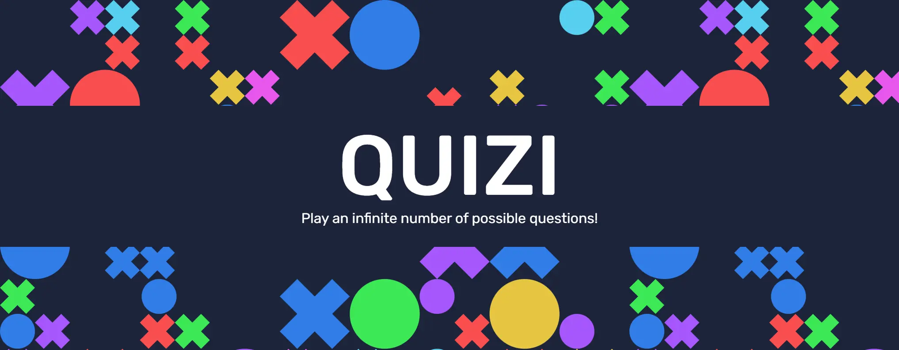
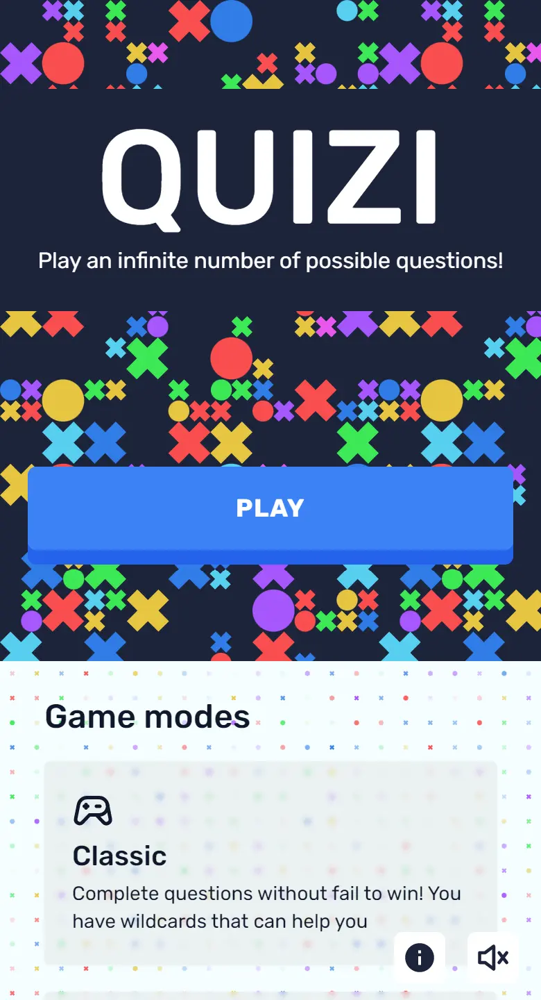
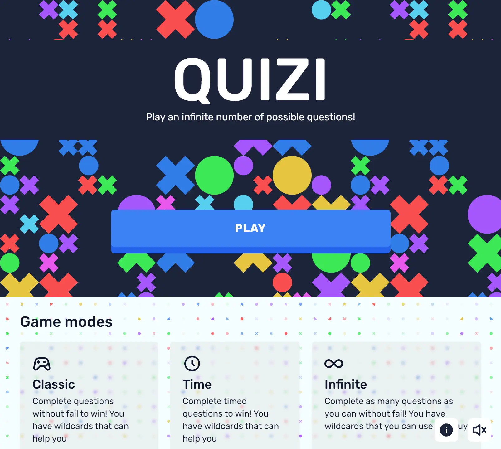
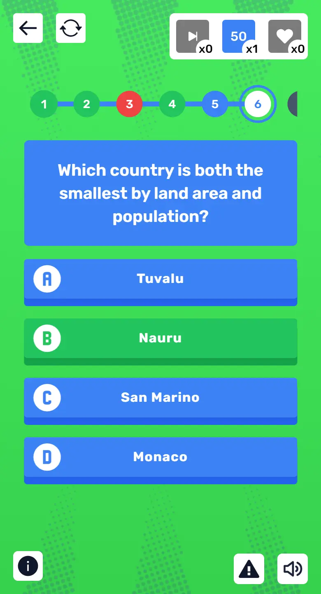
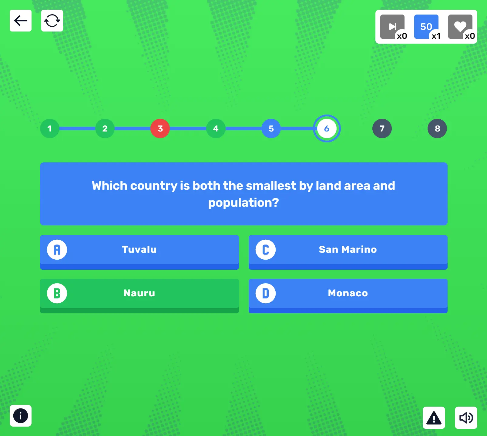
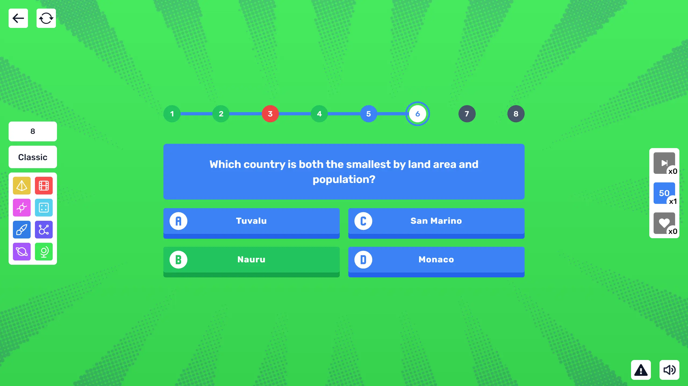
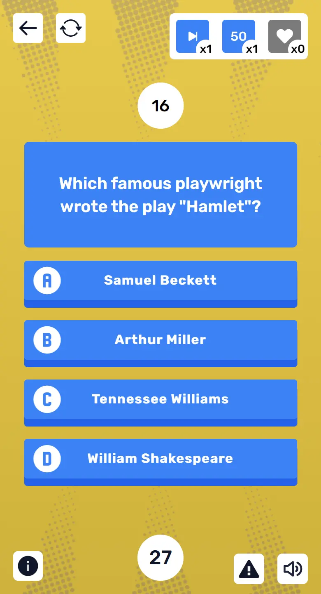
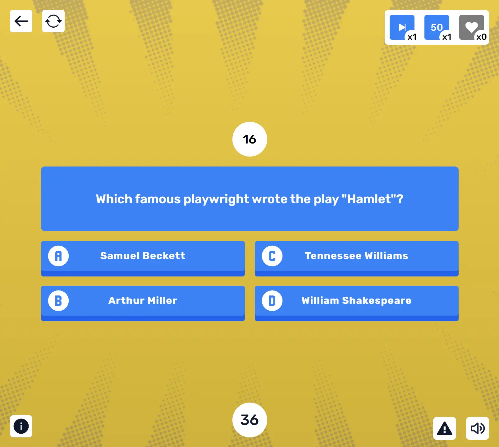
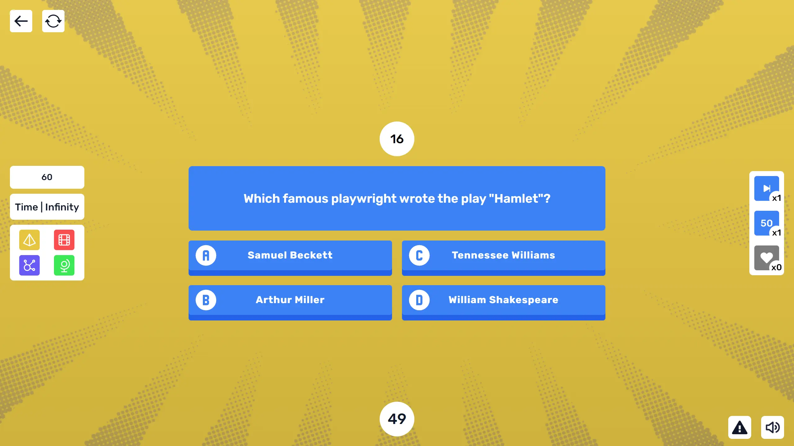

<div id="top"></div>

<!-- PROJECT LOGO -->
<div align="center">
<a href="https://quizi.vercel.app"></a>
<br/>
<br />

  # 🟥🟦 Quizi 🟨🟩

A quiz/trivia game with different modes and categories that you can select, as well as wildcards to help you. The questions are generated by artificial intelligence using the [Cohere API](https://dashboard.cohere.ai/welcome/register).

  <a href="https://quizi.vercel.app">View Demo</a>
  ·
  <a href="https://github.com/cosmoart/quiz-game/issues">Report Bug</a>
  ·
  <a href="https://github.com/cosmoart/quiz-game/issues">Request Feature</a>
</div>


<!-- TABLE OF CONTENTS -->
<details>
<summary>Table of contents</summary>

- [About The Project](#about-the-project)
- [Screenshots](#screenshots)
- [Built With](#built-with)
- [Getting Started](#getting-started)
- [License](#license)
- [Roadmap](#roadmap)
- [Contact](#contact)
</details>

<!-- ABOUT THE PROJECT -->
## About The Project

Quizi is a quiz/trivia game made with with [Cohere](https://cohere.ai). You can select different game modes and topics, you also have wildcards. Cohere's AI will generate the questions and answers for you.

> **Note:** Due to Cohere's policy change (from 100 to 5 free calls) now only some questions are generated by Cohere. The rest are pre-generated.

<p align="right"><a href="#top">⬆️ Back to top</a></p>


<!-- SCREENSHOTS -->
## Screenshots

<table>
    <tr>
      <td>
          
      </td>
      <td>
          
      </td>
      <td>
          
      </td>
    </tr>
        <tr>
      <td>
          
      </td>
      <td>
          
      </td>
      <td>
          
      </td>
    </tr>
    <tr>
      <td>
          
      </td>
      <td>
          
      </td>
      <td>
          
      </td>
    </tr>
</table>

<p align="right"><a href="#top">⬆️ Back to top</a></p>


### Built With

List of the frameworks, libraries and tools used to build the project.

* [Next.js](https://nextjs.org/)
* [React.js](https://reactjs.org/)
* [Zustand](https://github.com/pmndrs/zustand) For state management
* [Cohere](https://dashboard.cohere.ai/welcome/register) For the generation of questions
* [Vercel](https://vercel.com/) For hosting
* [Tailwind CSS](https://tailwindcss.com/) For styling
* [AnimatiSS](https://xsgames.co/animatiss/) For animations (title hover, correct and wrong answer)
* [Patternpad](https://patternpad.com/editor.html) For the home background pattern
* [Figma](https://www.figma.com/) For the design
* [React icons](https://react-icons.github.io/react-icons/) For icons
* [Iconify](https://iconify.design) For the answers letters icons
* [Tabler Icons](https://tablericons.com) For the categories icons
* [Canvas confetti](https://www.npmjs.com/package/canvas-confetti) For the confetti animation
* [Vector Halftone Maker](https://halftone.xoihazard.com) For the halftone effect

<p align="right"><a href="#top">⬆️ Back to top</a></p>


<!-- GETTING STARTED -->
## Getting Started

1. Clone or fork the repo
```sh
git clone https://github.com/cosmoart/quiz-game
```
2. Change directory to `source_code`
```sh
cd source_code
```
3. Install NPM packages
```sh
npm install
```
4. Run the project
```sh
npm run dev
```

If you are in development environment all the questions are pre-generated, if you want to use the Cohere API you have to create a `.env.local` file with the Cohere API key at `source_code` and comment the `if` in `source_code/src/helpers/getQuestions.js`. You can get one Cohere Api key [here](https://dashboard.cohere.ai/welcome/register).

The `.env.local` file should look like this:

```
COHERE_API_KEY=XXXXXXXXXXXXXXXXXX
```

<p align="right"><a href="#top">⬆️ Back to top</a></p>


<!-- LICENSE -->
## License

Distributed under the MIT License. See [`LICENSE.txt`](https://github.com/cosmoart/quiz-game/blob/main/LICENCE) for more information.

<p align="right"><a href="#top">⬆️ Back to top</a></p>


<!-- ROADMAP -->
## Roadmap

- [ ] ~~Circle wipe transition~~
- [x] Add offline mode
- [x] Buttons sounds
- [x] Win and Lose sounds
- [ ] ~~Multi-language Support~~
- [ ] ~~PWA~~
- [x] Personalize the game over screen for infinite mode
- [ ] ~~Personalize error page for API limit exceeded~~

<p align="right"><a href="#top">⬆️ Back to top</a></p>

<!-- CONTACT -->
## Contact

-   My website - [cosmoart.vercel.app](https://cosmoart.vercel.app)
-   Twitter - [@CosmoArt0](https://twitter.com/cosmoart0)
-   Instagram - [@cosmo_art0](https://www.instagram.com/cosmo_art0/)

<p align="right"><a href="#top">⬆️ Back to top</a></p>
