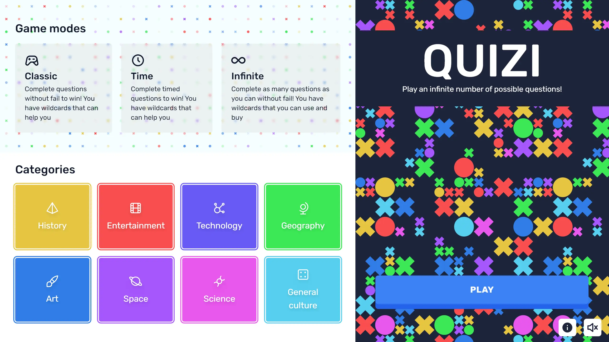

<!-- PROJECT LOGO -->

 
 

  # 🟥🟨🟦 Quizi 🟧🟩🟪

A quiz/trivia game made with with [Cohere](https://midu.link/ia) for the [Midudev Cohere hackathon](https://github.com/midudev/midu-cohere-hackathon)!

  <a href="https://quizi.vercel.app">View Demo</a>
  ·
  <a href="https://github.com/cosmoart/quiz-game">Report Bug</a>
  ·
  <a href="https://github.com/cosmoart/quiz-game">Request Feature</a>

<!-- TABLE OF CONTENTS -->

Table of contents

- [About The Project](#about-the-project)
- [Screenshots](#screenshots)
- [Built With](#built-with)
- [License](#license)
- [Contact](#contact)

<!-- ABOUT THE PROJECT -->
## About The Project

Quizi is a quiz/trivia game made with with [Cohere](https://midu.link/ia) for the [Midudev Cohere hackathon](https://github.com/midudev/midu-cohere-hackathon). You can select different game modes and topics. Cohere's AI will generate the questions and answers for you.

(<a href="#top">back to top</a>)

<!-- SCREENSHOTS -->
## Screenshots

<table>
    <tr>
      <td>
          
      </td>
      <td>
          
      </td>
      <td>
          
      </td>
    </tr>
</table>

(<a href="#top">back to top</a>)

### Built With

This section should list any major frameworks/libraries used to bootstrap your project. Leave any add-ons/plugins for the acknowledgements section. Here are a few examples.

* [Next.js](https://nextjs.org/)
* [React.js](https://reactjs.org/)
* [Cohere](https://midu.link/ia)
* [Vercel](https://vercel.com/)
* [Tailwind CSS](https://tailwindcss.com/)

(<a href="#top">back to top</a>)

<!-- LICENSE -->
## License

Distributed under the MIT License. See `LICENSE.txt` for more information.

(<a href="#top">back to top</a>)

<!-- CONTACT -->
## Contact

-   My website - [https://cosmoart.github.io](https://cosmoart.github.io)
-   Twitter - [@CosmoArt0](https://twitter.com/cosmoart0)
-   Instagram - [@cosmo_art0](https://www.instagram.com/cosmo_art0/)

(<a href="#top">back to top</a>)
